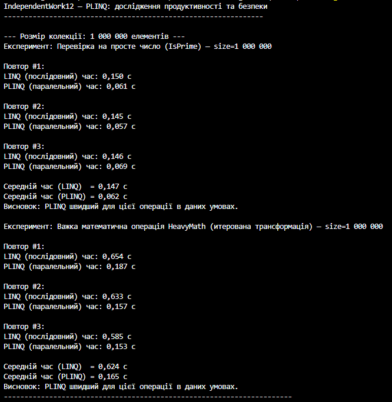
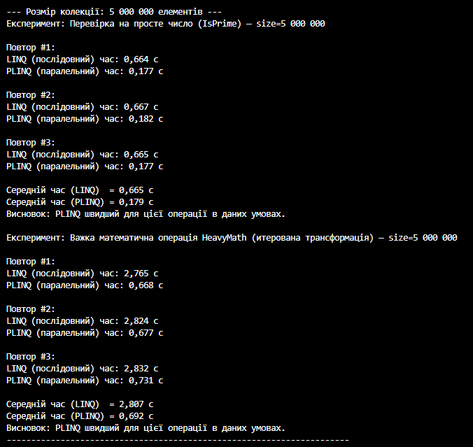
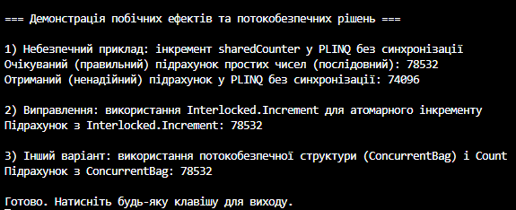

# Тема: PLINQ: дослідження продуктивності та безпеки.
## Мета: Дослідити переваги та недоліки PLINQ (Parallel LINQ) у порівнянні зі звичайним LINQ, виміряти його продуктивність на різних обсягах даних та проаналізувати потенційні проблеми безпеки при паралельній обробці.
## Теорія
- **LINQ** — послідовна обробка колекцій.  
- **PLINQ (Parallel LINQ)** — паралельна обробка, прискорює обчислювально важкі задачі.  
- **Переваги PLINQ:**  
  - Швидше на великих даних  
  - Автоматичне розподілення навантаження між ядрами  
- **Недоліки PLINQ:**  
  - Накладні витрати на малих колекціях  
  - Порушення порядку елементів  
  - Потенційні проблеми потокобезпеки при роботі зі спільними змінними

## Практична частина
- Було створено великі колекції даних (1–10 млн елементів).  
- Виконано обчислювально інтенсивні операції (перевірка на простоту, складні математичні обчислення).  
- Порівняно продуктивність LINQ та PLINQ за допомогою вимірювання часу виконання.  
- Виявлено, що PLINQ значно прискорює обробку на великих обчислювальних задачах.  

## Потокобезпечність
- Неправильне використання спільних змінних у PLINQ може призвести до race condition та некоректних результатів.  
- Проблему вирішено за допомогою:
  - `lock` для синхронізації  
  - потокобезпечних колекцій (`ConcurrentBag`, `ConcurrentDictionary`)  

## Результати (приклад)
- 1 млн елементів: PLINQ ~2× швидше за LINQ  
- 5 млн елементів: PLINQ ~4× швидше  
- 10 млн елементів: PLINQ значно ефективніший  

## Висновки
- PLINQ ефективний на великих та обчислювально складних колекціях.  
- На малих обсягах даних виграш мінімальний або відсутній.  
- Необхідно уникати побічних ефектів у паралельних операціях та використовувати механізми потокобезпеки.  

## Вивід програми
 
 
 