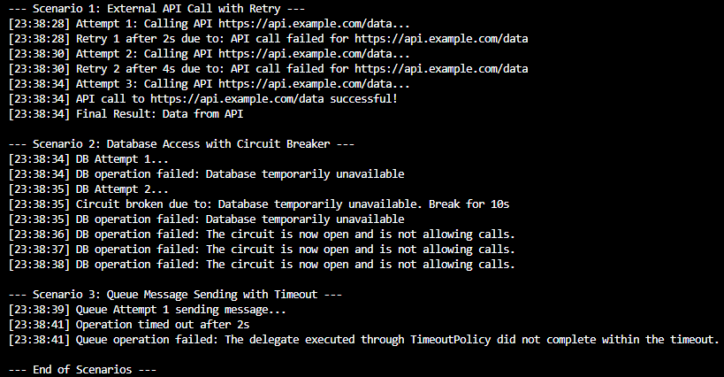

# Самостійна робота №13
## Тема: Кейси Polly/Retry: короткий звіт.
## Мета:Дослідити та проаналізувати реальні сценарії використання бібліотеки Polly для реалізації політик відмовостійкості (Retry, Circuit Breaker, Timeout) у .NET-застосунках.
## Теорія
- **Polly** — бібліотека для підвищення відмовостійкості застосунків у .NET.  
- Основні політики:  
  - **Retry** — повторні спроби виконання операції при тимчасових помилках.  
  - **Circuit Breaker** — тимчасово блокує виконання операції після кількох невдалих спроб.  
  - **Timeout** — обмежує максимальний час виконання операції.  
- Використання Polly допомагає уникнути аварійних збоїв при роботі з зовнішніми API, базами даних чи чергами повідомлень.

## Практична частина

### Scenario 1: External API Call with Retry
- **Проблема:** Зовнішній API може тимчасово повертати помилки.  
- **Політика:** Retry з експоненційною затримкою (2s, 4s, 8s).  
- **Очікувана поведінка:** Перша і друга спроби невдалі, третя успішна.  
- **Лог:** Повідомлення про кожну спробу і причину повтору, фінальний результат `"Data from API"`.

### Scenario 2: Database Access with Circuit Breaker
- **Проблема:** База даних може тимчасово бути недоступною.  
- **Політика:** Circuit Breaker після 2 помилок на 10 секунд.  
- **Очікувана поведінка:** Перші невдалі спроби відкривають "циркут", наступні виклики блокуються.  
- **Лог:** Повідомлення про невдалі спроби, розрив ланцюга, автоматичне відновлення через 10 секунд.

### Scenario 3: Queue Message Sending with Timeout
- **Проблема:** Операція відправки повідомлення може займати занадто багато часу.  
- **Політика:** Timeout на 2 секунди.  
- **Очікувана поведінка:** Якщо операція триває довше, виникає виняток.  
- **Лог:** Повідомлення про таймаут та невдалу спробу.

## Результати
- **Retry:** API виконується успішно після декількох повторів.  
- **Circuit Breaker:** Захищає систему від повторних викликів при тимчасових збоях бази даних.  
- **Timeout:** Забезпечує контроль часу виконання критичних операцій.

## Висновки
- Polly забезпечує відмовостійкість у .NET-застосунках.  
- Retry дозволяє автоматично повторювати тимчасові невдачі.  
- Circuit Breaker захищає від навантаження на систему при повторних помилках.  
- Timeout контролює час виконання операцій і запобігає "зависанню".  
- Для коректної роботи важливо логувати всі спроби та обирати політики відповідно до сценарію.

## Вивід програми
