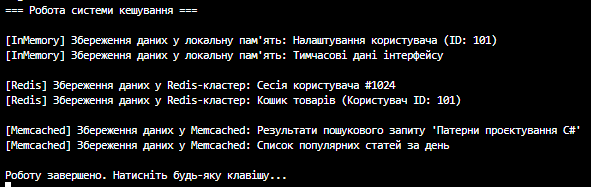

# Самостійна робота №19: Система кешування

## Опис проєкту

Цей проєкт, який демонструє реалізацію гнучкої системи кешування даних. Головна мета роботи - практичне застосування породжувальних патернів проєктування **Factory Method** та **Singleton** для створення архітектури, яку легко масштабувати та підтримувати.

## Використані патерни проєктування

1. **Singleton - клас `CacheManager**`
* **Призначення:** Гарантує, що в системі існує лише один екземпляр менеджера кешування, який надає глобальну точку доступу до нього.
* **Реалізація:** Клас має приватний конструктор та статичну властивість `Instance`, яка створює об'єкт лише при першому зверненні. Це дозволяє централізовано керувати тим, куди саме кешуються дані в даний момент.

2. **Factory Method - ієрархія `CacheFactory**`
* **Призначення:** Дозволяє делегувати логіку створення конкретних об'єктів кешу (Redis, Memcached, InMemory) підкласам, не прив'язуючи основний код до конкретних класів.
* **Реалізація:** Абстрактний клас `CacheFactory` визначає метод `CreateCache()`, а конкретні фабрики (`RedisCacheFactory`, `MemcachedCacheFactory`, `InMemoryCacheFactory`) реалізують його, повертаючи відповідний тип кешу.

## Структура класів

* **`ICache`** - загальний інтерфейс для всіх типів кешу з методом `Save(string data)`.
* **`InMemoryCache`, `RedisCache`, `MemcachedCache**` - конкретні класи, що імітують збереження даних у різні сховища.
* **`CacheFactory`** - базовий абстрактний клас фабрики.
* **`InMemoryCacheFactory`, `RedisCacheFactory`, `MemcachedCacheFactory**` - конкретні фабрики, які інкапсулюють створення відповідних об'єктів кешу.
* **`CacheManager`** - клас-одинак, що зберігає поточну фабрику та забезпечує виконання операції кешування через метод `CacheData`.

## Приклад виводу в консоль

## Висновок

Завдяки використанню патерну **Factory Method**, додавання нових типів кешування (наприклад, `FileCache` чи `DatabaseCache`) вимагатиме лише створення нового класу кешу та його фабрики, не змінюючи існуючий код системи (дотримання принципу Open/Closed). Патерн **Singleton** забезпечує єдину точку управління цією гнучкою інфраструктурою.