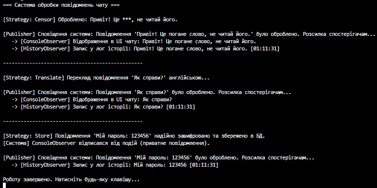

# Самостійна робота №20: Система обробки повідомлень чату

## Опис проєкту

Цей проєкт демонструє реалізацію гнучкої системи обробки даних на прикладі чату. Головна мета роботи - практичне застосування поведінкових патернів проєктування **Strategy** та **Observer** для створення архітектури, яка дозволяє динамічно змінювати алгоритми обробки тексту та автоматично сповіщати залежні компоненти системи.

## Використані патерни проєктування

1. **Strategy - клас `DataContext` та ієрархія `IDataProcessorStrategy**`

* **Призначення:** Дозволяє винести різні алгоритми (цензурування, переклад, збереження) в окремі класи та перемикатися між ними під час виконання програми, не змінюючи код основного класу.
* **Реалізація:** Клас `DataContext` приймає об'єкт стратегії через конструктор та делегує йому виконання через метод `ExecuteProcessing()`. Стратегію можна змінити за допомогою методу `SetStrategy()` без зміни основного коду.

2. **Observer - клас `DataPublisher` та класи-спостерігачі**

* **Призначення:** Створює механізм підписки, щоб одні об'єкти (спостерігачі) могли автоматично отримувати сповіщення про зміни або події в іншому об'єкті (видавці).
* **Реалізація:** Реалізовано за допомогою вбудованого механізму подій C# (`event Action<string> DataProcessed`). Спостерігачі підписуються на цю подію, а `DataPublisher` викликає її після завершення обробки повідомлення, розсилаючи дані всім підписникам.

## Структура класів

* **`IDataProcessorStrategy`** - загальний інтерфейс для всіх алгоритмів обробки з методом `Process(string data)`.
* **`CensorWordsStrategy`, `TranslateMessageStrategy`, `StoreMessageStrategy`** - конкретні класи стратегій, що імітують різну логіку роботи з текстом повідомлення.
* **`DataContext`** - клас-контекст, що зберігає посилання на поточну стратегію та керує її виконанням.
* **`DataPublisher`** - клас-видавець, що містить подію `DataProcessed` та ініціює сповіщення системи.
* **`ConsoleOutputObserver`, `MessageHistoryObserver`** - конкретні класи-спостерігачі, які підписуються на подію та виконують відповідні дії (вивід на екран UI або запис в історію логів).

## Приклад виводу в консоль

## Висновок

Завдяки використанню патерну **Strategy**, додавання нових способів обробки повідомлень (наприклад, стиснення або шифрування) вимагатиме лише створення нового класу стратегії, не змінюючи код існуючого контексту (дотримання принципу Open/Closed). Патерн **Observer** робить систему слабкозв'язною: ми можемо легко додавати нових слухачів (наприклад, відправку аналітики або Push-сповіщень), абсолютно не змінюючи код самого видавця повідомлень.