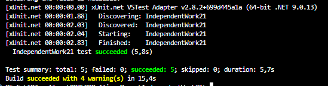

# Самостійна робота №21: Інтеграційні тести патернів
 Опис проєкту
Цей проєкт демонструє підхід до інтеграційного тестування архітектури, яка поєднує чотири дизайн-патерни: **Singleton** (`RequestManager`), **Factory Method** (`RequestFactory`), **Strategy** (`IAuthStrategy`) та **Observer** (`OnRequestProcessed`). 
Система імітує обробку мережевих запитів з динамічною зміною автентифікації та розсилкою сповіщень. Для тестування використано фреймворк **xUnit**.

## Перелік інтеграційних сценаріїв та результати

### Позитивні сценарії
1. **Перевірка стабільності Singleton (`Positive_SingletonStateIsStable`)**
   * **Очікування:** Кілька звернень до `RequestManager.Instance` повертають одне й те саме посилання на об'єкт.
   * **Фактичний результат:** Пройдено успішно.
2. **Повна інтеграція компонентів (`Positive_FullIntegration_HttpWithOAuth`)**
   * **Очікування:** `RequestManager` коректно створює HTTP-запит через Factory, застосовує OAuth стратегію і успішно сповіщає підписаного Observer'а.
   * **Фактичний результат:** Пройдено успішно (очікуваний рядок логу збігається з фактичним).
3. **Динамічна зміна стратегії (`Positive_DynamicStrategyChange`)**
   * **Очікування:** Заміна стратегії в `runtime` (з BasicAuth на OAuth) змінює поведінку системи без її перезапуску, і Observer фіксує обидва різні результати.
   * **Фактичний результат:** Пройдено успішно.

### Негативні та граничні сценарії
4. **Відсутність стратегії (`Negative_MissingStrategy`)**
   * **Очікування:** Спроба викликати метод обробки даних без попередньо встановленої стратегії викликає виняток `InvalidOperationException`.
   * **Фактичний результат:** Пройдено успішно.
5. **Відписка спостерігача (`Edge_ObserverUnsubscribed`)**
   * **Очікування:** Якщо Observer відписався від події (`-=`), він більше не отримує сповіщень, навіть якщо обробка запитів продовжується.
   * **Фактичний результат:** Пройдено успішно (список отриманих повідомлень залишився порожнім).

## Результати тестування

## Висновки
1. **Singleton у тестах:** Використання глобального стану (Singleton) створює ризик "забруднення" стану між тестами. Ризик мінімізовано шляхом створення методу `ResetForTesting()`, який викликається в методах Setup/Teardown інфраструктури xUnit.
2. **Нульові посилання:** Ризик виклику Observer-події `null` або передачі порожньої стратегії. Опрацьовано введенням Null-перевірок (`?.Invoke`) та генерацією винятків на рівні `RequestManager`.
3. Загалом, архітектура довела свою гнучкість: патерни чудово доповнюють один одного, забезпечуючи слабку зв'язність коду (Loose Coupling).