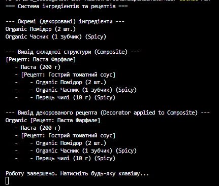

# Самостійна робота №22: Система інгредієнтів та рецептів

## Опис проєкту

Цей проєкт демонструє гнучку реалізацію структури даних для кулінарних рецептів. Головна мета роботи — практичне застосування структурних патернів проєктування **Composite** та **Decorator** для створення ієрархічних структур і динамічного розширення їх функціональності без зміни вихідного коду класів.

## Використані патерни проєктування

1. **Composite — класи `Recipe` та `SingleIngredient`**
* **Призначення:** Дозволяє групувати об'єкти в деревоподібні структури (наприклад, інгредієнти всередині рецептів, а рецепти — всередині інших рецептів) і працювати з ними так само, як із єдиним об'єктом.
* **Реалізація:** Інтерфейс `IComponent` задає спільну операцію `GetDescription()`. `SingleIngredient` (Leaf) просто повертає свою назву, а `Recipe` (Composite) збирає описи всіх своїх дочірніх елементів і форматує їх у вигляді списку.

2. **Decorator — ієрархія `Decorator`**
* **Призначення:** Дозволяє динамічно "обгортати" об'єкти, додаючи їм нові властивості чи поведінку, не порушуючи їхньої структури.
* **Реалізація:** Абстрактний клас `Decorator` зберігає посилання на `IComponent`. Конкретні реалізації `OrganicDecorator` та `SpicyDecorator` перевизначають метод `GetDescription()`, додаючи до результату префікс `Organic ` або суфікс ` (Spicy)`.

## Структура класів

* **`IComponent`** — загальний інтерфейс для інгредієнтів і рецептів.
* **`SingleIngredient`** — конкретний клас кінцевого об'єкта (Leaf) із властивостями `Name` та `Quantity`.
* **`Recipe`** — клас-композит, що містить список об'єктів типу `IComponent` та методи для управління ними (`Add`, `Remove`).
* **`Decorator`** — базовий абстрактний клас декоратора.
* **`OrganicDecorator`, `SpicyDecorator`** — конкретні декоратори, які модифікують текстовий опис об'єкта.

## Приклад виводу в консоль

## Висновок

Поєднання патернів **Composite** та **Decorator** є надзвичайно потужним. **Composite** дозволяє будувати складну структуру рецептів будь-якої глибини вкладеності. Водночас **Decorator** дозволяє застосовувати модифікатори (наприклад, "Organic" або "Spicy") як до окремих інгредієнтів (базового рівня), так і до цілих складних рецептів (до кореня дерева), демонструючи максимальну гнучкість архітектури (Loose Coupling).