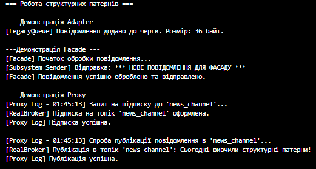

# Самостійна робота №23: Система обробки повідомлень (Adapter, Facade, Proxy)

## Опис проєкту

Цей проєкт демонструє практичне застосування трьох ключових структурних патернів проєктування: **Adapter**, **Facade** та **Proxy**. Мета роботи - показати, як ці патерни допомагають інтегрувати несумісні компоненти, спрощувати складні інтерфейси та контролювати доступ до об'єктів у системі обробки повідомлень.

## Використані патерни проєктування

1. **Adapter - класи `LegacyMessageAdapter` та `LegacyMessageQueue`**
* **Призначення:** Дозволяє об'єктам із несумісними інтерфейсами працювати разом.
* **Реалізація:** Інтерфейс `IMessageSender` очікує рядок (string), але стара система `LegacyMessageQueue` приймає лише масиви байтів (byte[]). Клас `LegacyMessageAdapter` реалізує потрібний інтерфейс і бере на себе конвертацію даних, приховуючи цей процес від клієнта.

2. **Facade - клас `MessageProcessingFacade`**
* **Призначення:** Надає простий і зрозумілий інтерфейс до складної системи класів, фреймворку або бібліотеки.
* **Реалізація:** Замість того, щоб клієнт вручну викликав `MessageValidator`, `MessageFormatter` та `MessageSender`, він викликає один метод `ProcessAndSend()` у класі Фасаду. Фасад сам координує роботу підсистем.

3. **Proxy - клас `LoggingMessageBrokerProxy`**
* **Призначення:** Надає об'єкт-замінник для контролю доступу до іншого об'єкта (наприклад, для логування, перевірки прав доступу або ледачого завантаження).
* **Реалізація:** Проксі-клас реалізує той самий інтерфейс `IMessageBroker`, що й реальний брокер повідомлень. Перед тим як передати виклик до `RealMessageBroker`, проксі виводить логічну інформацію з мітками часу. Також реалізовано патерн Lazy Loading - реальний об'єкт створюється лише тоді, коли він дійсно потрібен.

## Структура класів

* **Adapter:** `IMessageSender` (Target), `LegacyMessageQueue` (Adaptee), `LegacyMessageAdapter`.
* **Facade:** `MessageFormatter`, `MessageValidator`, `MessageSenderSubsystem` (Subsystem classes), `MessageProcessingFacade`.
* **Proxy:** `IMessageBroker` (Subject), `RealMessageBroker` (RealSubject), `LoggingMessageBrokerProxy`.

## Приклад виводу в консоль

## Висновок

Кожен з використаних патернів вирішує специфічну архітектурну проблему:
* **Adapter** рятує при інтеграції легасі-коду.
* **Facade** зменшує зв'язність (Coupling) між клієнтом і складною логікою підсистеми.
* **Proxy** ідеально підходить для наскрізного функціоналу (Cross-cutting concerns), такого як логування чи кешування, дотримуючись принципу єдиної відповідальності.