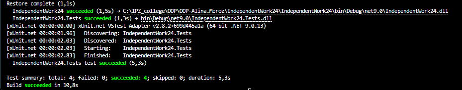

# Самостійна робота №24: Інтеграція структурних патернів (Composite, Decorator, Proxy)

## Опис проєкту
Цей проєкт демонструє поєднання трьох структурних патернів проєктування в єдиному сценарії E-commerce (система розрахунку вартості замовлень). 
- **Composite** дозволяє групувати товари в коробки (деревоподібна структура).
- **Decorator** дозволяє динамічно додавати знижки до окремих товарів або цілих коробок.
- **Proxy** реалізує механізм контролю доступу на основі ролей та кешування обчислень для оптимізації швидкодії.

## Що перевірено тестами (xUnit)
У проєкті реалізовано 4 інтеграційні тести:
1. **`Composite_CalculatesCorrectTotal` (Позитивний):** Перевіряє, чи правильно обчислюється вартість вкладених коробок.
2. **`Decorator_AppliesDiscount` (Позитивний):** Перевіряє коректність застосування декоратора знижки до складного об'єкта `Box`.
3. **`Proxy_CachesResult` (Позитивний / Продуктивність):** Вимірює час виконання. Доводить, що при повторному запиті Proxy повертає значення миттєво з кешу, обходячи ресурсоємну операцію `CalculateTotal()`.
4. **`Proxy_ThrowsUnauthorizedAccessException` (Негативний):** Перевіряє граничний випадок, коли неавторизований користувач (роль "Guest") намагається отримати доступ до розрахунків (очікується виняток).

## Оцінка продуктивності та компроміси (Trade-offs)

### Порівняння базового та проксійованого сценаріїв
У базовому сценарії виклик методу `CalculateTotal()` для великого дерева об'єктів `Box` вимагає рекурсивного обходу всіх дочірніх елементів. Це створює навантаження на процесор (у коді імітовано через `Thread.Sleep`). Завдяки використанню **Proxy** з механізмом кешування, час доступу при повторних викликах зменшується з $O(N)$ до $O(1)$.

### Результати тестування

### Висновки
1. **Ускладнення дебагінгу (Over-engineering):** Поєднання Decorator та Proxy означає, що реальний об'єкт може бути загорнутий у кілька шарів абстракції (наприклад, `Proxy -> DiscountDecorator -> Box -> Product`). Це ускладнює відстеження помилок у стеку викликів (Stack Trace).
2. **Інвалідація кешу:** У поточній реалізації `SecureCachedOrderProxy` кешує значення назавжди. Якщо до `Box` додати новий товар після кешування, Proxy поверне застарілу суму. Компроміс: використання кешу вимагає складної логіки його інвалідації при мутації стану (наприклад, підписка на події змін через патерн Observer).
3. **Гнучкість проти Споживання пам'яті:** Патерн Decorator дозволяє уникнути "вибуху підкласів" (не потрібно створювати `DiscountedBox`, `DiscountedProduct` тощо), але створює велику кількість дрібних об'єктів-обгорток у пам'яті (Heap allocation), що може вплинути на роботу Garbage Collector у високонавантажених системах.