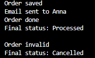

# Лабораторна робота №20  
## Тема: SRP – декомпозиція OrderProcessor

### Мета роботи
Застосувати принцип єдиної відповідальності (SRP) для декомпозиції складного класу OrderProcessor на менші, більш сфокусовані компоненти.

### Завдання роботи
- Реалізувати приклад коду, який порушує принцип SRP
- Виконати рефакторинг цього коду з дотриманням SRP
- Продемонструвати роботу програми для валідного та невалідного замовлення

### Опис реалізації

У роботі було реалізовано два варіанти коду:

1. **Поганий варіант**
   - Один клас відповідає за перевірку замовлення, його збереження, відправку email та зміну статусу
   - Такий підхід порушує принцип SRP, оскільки клас має декілька відповідальностей

2. **Виправлений варіант (з дотриманням SRP)**
   - Логіка розділена на окремі частини:
     - перевірка замовлення
     - збереження замовлення
     - надсилання email
   - Клас `OrderService` лише координує роботу інших компонен

### Демонстрація результату 
