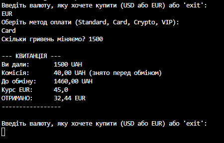

# Тема: OCP: гнучкі алгоритми розрахунку (Factory/Strategy).
# Мета: Застосувати принцип відкритості/закритості (OCP) для створення гнучкої системи розрахунків за допомогою патернів Factory Method та Strategy, забезпечивши можливість легкого додавання нових алгоритмів без зміни існуючого коду.

Метою роботи було створити програмну модель пункту обміну валют. Програма має приймати від користувача суму в гривнях, вираховувати комісію залежно від типу операції (готівка, картка, криптовалюта) та конвертувати залишок у вибрану іноземну валюту (USD або EUR).

#### Технічна реалізація (Патерни проєктування)

Для забезпечення гнучкості коду я використала такі архітектурні рішення:

* **Патерн Стратегія (Strategy):**
Логіка розрахунку комісії винесена в окремі класи, що реалізують інтерфейс `IExchangeStrategy`:
* `StandardExchangeStrategy` — стандартна комісія (1% + 5 грн).
* `CardExchangeStrategy` — комісія для карток (2% + 10 грн).
* `CryptoExchangeStrategy` — комісія для крипти (0.5%, мін. 20 грн).
* *Важливо:* Ці класи лише рахують комісію, вони не знають про курс долара чи євро. Це робить їх універсальними.

* **Патерн Фабрика (Factory Method):**
Клас `ExchangeStrategyFactory` приймає рядок тексту (наприклад, "card") і повертає готовий об'єкт відповідної стратегії. Це дозволяє обирати метод оплати на етапі виконання програми.
* **Сервіс обміну (ExchangeService):**
Цей клас виконує основну роботу:
1. Запитує у Стратегії розмір комісії.
2. Віднімає комісію від суми клієнта.
3. Ділить "чисту" суму на курс обраної валюти (USD або EUR).

#### Демонстрація принципу OCP 

Принцип "Відкритості/Закритості" вимагає, щоб була змога додавати нові функції без зміни старого коду.

* **Як це зроблено:** Я додала можливість обслуговування **VIP-клієнтів**.
* **Реалізація:** Створено новий клас `VipExchangeStrategy`, де комісія завжди дорівнює 0.
* **Результат:** Не довелося змінювати складну логіку конвертації у класі `ExchangeService`. Лише додався новий клас і зареєструвався його у Фабриці. Це доводить, що система є гнучкою та розширюваною.

#### Висновок

У результаті виконання роботи створено повноцінний консольний конвертер валют. Використання патернів дозволило розділити логіку комісій та логіку обміну. Завдяки цьому програма легко масштабується, а код залишається чистим і зрозумілим.

