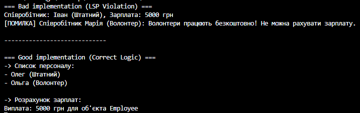

### Тема: LSP: виявлення порушень і альтернативи.
### Мета: Поглибити розуміння принципу підстановки Лісков (LSP), навчитися ідентифікувати його порушення в ієрархіях класів та застосовувати альтернативні підходи (композиція, зміна ієрархії) для створення LSP-сумісних рішень.

### 1. Постановка завдання

Необхідно проаналізувати ієрархію класів `Employee` та `Volunteer`. У базовому класі є метод нарахування зарплати. Оскільки волонтери працюють безкоштовно, виникає проблема: як реалізувати цей метод у класі `Volunteer` так, щоб не порушити принцип підстановки Лісков (LSP).

### 2. Що таке принцип LSP?

Простими словами, принцип Лісков каже: **"Якщо код працює з базовим класом (Батьком), він має так само добре працювати і з будь-яким його спадкоємцем (Сином), навіть не знаючи про це"**.
Якщо ми підставляємо спадкоємця, а програма ламається або поводиться дивно — це порушення LSP.

### 3. Аналіз проблеми

У першій частині коду я створила клас `Volunteer`, який успадковувався від `Employee`.

* У `Employee` є метод `CalculateSalary()`, який повертає гроші.
* Але волонтер грошей не отримує. Тому в його методі я була змушена написати `throw new Exception`.

**Результат** Коли бухгалтерська програма проходить списком по всіх співробітниках і рахує зарплату, на волонтері вона "вилітає" з помилкою. Волонтер не зміг замінити співробітника коректно. Це і є порушення LSP.

### 4. Вирішення проблеми (Рефакторинг)

Щоб виправити це, я змінила ієрархію класів, розділивши поняття "людина в команді" і "людина, яка отримує зарплату".

1. Створила базовий клас `StaffMember` (Член персоналу). У ньому є тільки ім'я.
2. Створила інтерфейс `IPayable` (Той, кому платять) з методом `CalculateSalary()`.
3. **Клас `Employee`:** успадковує `StaffMember` І реалізує `IPayable`.
4. **Клас `Volunteer`:** успадковує тільки `StaffMember`.

**Як це допомогло?**
Тепер ми фізично не можемо викликати метод "Порахувати зарплату" у волонтера — компілятор цього просто не дозволить. Ми рахуємо зарплату тільки тим об'єктам, які мають "бейдж" `IPayable`.

### 5. Результати роботи програми

На скріншоті видно:

1. У першому блоці (Bad Implementation) програма видала помилку при спробі нарахувати зарплату волонтеру Марії.
2. У другому блоці (Good Implementation) програма успішно вивела весь список персоналу, а зарплату нарахувала тільки штатному працівнику Олегу. Волонтер Ольга була проігнорована модулем зарплат, що є правильно.

