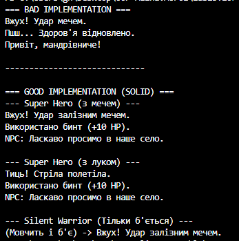

### Тема: ISP & DIP: рефакторинг і DI через конструктор.
### Мета: Застосувати принципи розділення інтерфейсу (ISP) та інверсії залежностей (DIP) для рефакторингу існуючого коду, а також реалізувати Dependency Injection (DI) через конструктор для зменшення зв’язаності та покращення тестування.

### Завдання

Є код гри, де герой жорстко прив'язаний до своєї зброї та вмінь (створює їх через `new`). Потрібно переписати його так, щоб зброю та інші інструменти можна було змінювати, не ламаючи код героя.

### Хід роботи

**А. Аналіз проблеми (Bad Code)**
У початковій версії клас `HeroAction` сам створював собі меч, аптечку та діалоги.

* **Чому це погано:** Я не могла дати герою лук замість меча, не переписуючи код самого героя.
* **Порушення ISP:** Герой мав методи `Attack`, `Heal`, `Speak` в одній купі. Якщо створити персонажа, який не вміє говорити, йому все одно нав'язувався метод `Speak`.

**Б. Виправлення (Good Code)**
Я розділила логіку на окремі частини:

1. **Створила інтерфейси (ISP):**
Замість одного великого класу зробила три маленькі інтерфейси:
* `IWeapon` (тільки атака);
* `IHealer` (тільки лікування);
* `ITalker` (тільки розмови).


2. **Застосувала Dependency Injection (DIP):**
Тепер клас `SuperHero` не створює об'єкти сам. Він отримує їх готовими через конструктор:
```csharp
public SuperHero(IWeapon weapon, IHealer healer, ITalker talker)
{
    _weapon = weapon; // Герой просто бере те, що дали
    _healer = healer;
    _talker = talker;
}

```


**В. Результат**
У `Main` я створила два варіанти героя, використовуючи один і той самий клас `SuperHero`:

1. Героя з мечем.
2. Героя з луком (просто передала інший об'єкт у конструктор).

Також створила клас `SilentWarrior`, який використовує тільки інтерфейс `IWeapon`, що доводить користь розділення інтерфейсів.

### 4. Скріншот роботи програми

