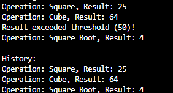

# Лабораторна робота №24  
## Тема: Strategy + Observer: динамічна підстановка алгоритмів + тести

## 1. Мета роботи

Метою роботи є застосування патернів проєктування Strategy та Observer для створення гнучкої системи обробки числових даних, яка дозволяє динамічно змінювати алгоритми обчислень та автоматично сповіщати залежні компоненти про отримані результати.

## 2. Теоретичні відомості

### 2.1 Патерн Strategy

Патерн Strategy є поведінковим патерном проєктування, який дозволяє визначити сімейство алгоритмів, інкапсулювати їх у окремі класи та забезпечити можливість їх взаємозаміни без зміни коду клієнта.

У межах даної роботи:

- Створено інтерфейс `INumericOperationStrategy`, який визначає метод `Execute(double value)`.
- Реалізовано конкретні стратегії:
  - `SquareOperationStrategy`
  - `CubeOperationStrategy`
  - `SquareRootOperationStrategy`
- Створено клас `NumericProcessor`, який приймає стратегію через конструктор та дозволяє змінювати її під час виконання за допомогою методу `SetStrategy`.

Таким чином, об'єкт `NumericProcessor` може змінювати свою поведінку динамічно, не змінюючи власної реалізації.

### 2.2 Патерн Observer

Патерн Observer є поведінковим патерном, який забезпечує механізм підписки об'єктів на події іншого об'єкта з автоматичним сповіщенням у разі зміни його стану.

У межах даної роботи:

- Створено клас `ResultPublisher`, який містить подію:

  `public event Action<double, string> ResultCalculated;`

- Реалізовано класи-спостерігачі:
  - `ConsoleLoggerObserver`
  - `HistoryLoggerObserver`
  - `ThresholdNotifierObserver`

Після обчислення результату викликається метод `PublishResult`, який активує подію та повідомляє всі підписані об'єкти.

## 3. Структура програмної реалізації

Проєкт складається з наступних компонентів:

1. Інтерфейс стратегій `INumericOperationStrategy`.
2. Конкретні реалізації стратегій обробки числових даних.
3. Клас-контекст `NumericProcessor`.
4. Клас-публікатор подій `ResultPublisher`.
5. Класи-спостерігачі.
6. Метод `Main`, який демонструє роботу системи.

## 4. Демонстрація роботи програми

У методі `Main` виконуються такі дії:

1. Створюється об'єкт `NumericProcessor` з початковою стратегією.
2. Створюється об'єкт `ResultPublisher`.
3. Створюються об'єкти-спостерігачі.
4. Виконується підписка спостерігачів на подію `ResultCalculated`.
5. Здійснюється обробка кількох числових значень.
6. Стратегія обробки змінюється під час виконання програми.
7. Після кожного обчислення публікується результат.
8. Виводиться історія виконаних операцій.

Програма компілюється та запускається без помилок.

