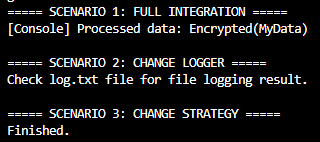

# Лабораторна робота №25
## Тема: Інтеграція патернів

## Мета роботи

Розробити консольну програму, яка демонструє спільну роботу патернів 
Factory Method, Singleton, Strategy та Observer.

## Короткий опис реалізації

У програмі реалізовано систему обробки даних з логуванням результатів.

### 1. Factory Method

Створено:
- Інтерфейс ILogger
- Класи ConsoleLogger та FileLogger
- Абстрактний клас LoggerFactory
- Конкретні фабрики ConsoleLoggerFactory та FileLoggerFactory

Фабрика відповідає за створення потрібного типу логера.

### 2. Singleton

Створено клас LoggerManager, який:
- має лише один екземпляр
- зберігає поточний логер
- дозволяє змінювати фабрику під час виконання

### 3. Strategy

Створено:
- Інтерфейс IDataProcessorStrategy
- Стратегії EncryptDataStrategy та CompressDataStrategy
- Клас DataContext, який приймає стратегію

Стратегію можна змінювати під час роботи програми.

### 4. Observer

Створено:
- Клас DataPublisher з подією DataProcessed
- Клас ProcessingLoggerObserver, який підписується на подію

Після обробки даних викликається подія, і спостерігач автоматично логуює результат.

## Демонстрація сценаріїв

### Сценарій 1 – Повна інтеграція
- Використовується ConsoleLogger
- Стратегія шифрування
- Дані обробляються та логуються в консоль

### Сценарій 2 – Зміна логера
- Фабрика змінюється на FileLoggerFactory
- Логування починає записуватись у файл log.txt

### Сценарій 3 – Зміна стратегії
- Стратегія змінюється на CompressDataStrategy
- Дані обробляються іншим способом

