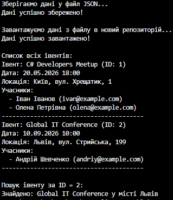

### Звіт про виконання лабораторної роботи №28
**Тема:** Серіалізація об’єктів у JSON.
**Мета роботи:** Навчитися серіалізувати та десеріалізувати складні об’єкти у форматі JSON, зберігати дані у файли та завантажувати їх за допомогою засобів мови C#.

#### Архітектура та предметна область
Для виконання завдання я спроєктувала предметну область "Івенти". Щоб продемонструвати серіалізацію складних структур даних (об'єкт в об'єкті та колекції), я реалізувала три взаємопов'язані класи:
* **`Event`** — головна сутність (ідентифікатор, назва, дата).
* **`Location`** — вкладений об'єкт (місто, адреса).
* **`Participant`** — учасник. В об'єкті `Event` зберігається колекція (`List<Participant>`) таких учасників.

#### Реалізація репозиторію
Згідно з принципами ООП, логіку роботи з даними було винесено в окремий клас `EventRepository`, який реалізує інтерфейс `IEventRepository`. 
* Внутрішній стан репозиторію інкапсульовано у приватний список `_events`.
* Для конвертації об'єктів використано простір імен `System.Text.Json`. 
* Для зручності перевірки файлу я додала налаштування `JsonSerializerOptions { WriteIndented = true }`, що робить згенерований JSON-файл структурованим та зручним для читання людиною.
* Операції запису (`SaveToFileAsync`) та читання (`LoadFromFileAsync`) реалізовані **асинхронно** за допомогою потоків `FileStream`, що запобігає блокуванню програми під час роботи з файловою системою.

#### Метод Main
У головному методі програми було змодельовано повний життєвий цикл роботи з даними:
1. Створено екземпляр репозиторію та наповнено його двома івентами з різними локаціями та списками учасників.
2. Дані успішно серіалізовано та збережено у файл `events_data.json`.
3. Для перевірки чистоти експерименту, було створено *новий* (порожній) екземпляр репозиторію, в який успішно десеріалізувалися дані з файлу.
4. Метод `GetAll()` коректно вивів усю відновлену ієрархію на екран, а метод `GetById(2)` успішно знайшов конкретний івент за його ідентифікатором.

#### Вивід у консолі

#### Висновок
Під час виконання лабораторної роботи я на практиці засвоїла механізми серіалізації та десеріалізації складних об'єктів у формат JSON. Я закріпила навички роботи з колекціями, асинхронними методами та потоками вводу/виводу у C#. Розроблена програма працює коректно, всі поставлені в завданні вимоги виконано в повному обсязі.