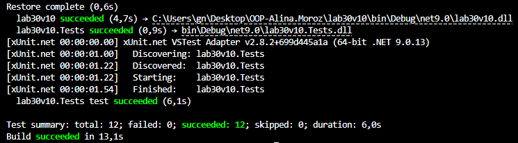

# Лабораторна робота №30

## Тема
Написання юніт-тестів з xUnit

## Мета роботи

Навчитися створювати та запускати юніт-тести для перевірки програмного коду за допомогою фреймворку **xUnit**.

## Хід роботи

Було створено основний проєкт **lab30v10** та тестовий проєкт **lab30v10.Tests**.
У основному проєкті реалізовано клас **DiscountCalculator** з методами **CalculateDiscount** та **ApplyCoupon**, які виконують обчислення знижки та застосування купонів.

У тестовому проєкті було написано **10 юніт-тестів** з використанням атрибутів **[Fact]** та **[Theory]**. Тести перевіряють правильність обчислень, роботу різних купонів, а також обробку помилок і крайніх випадків.

## Вивід результату
