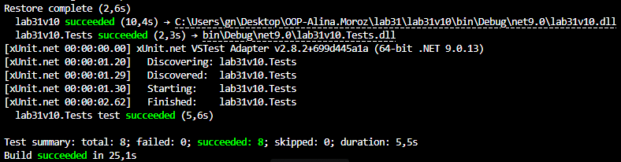

# Лабораторна робота №31

## Тема

Тестування з використанням Moq (мокінг залежностей)

## Мета роботи

Навчитися створювати **mock-об’єкти** та тестувати класи із залежностями за допомогою бібліотеки **Moq**.

## Хід роботи

Було створено основний проєкт **lab31v10** та тестовий проєкт **lab31v10.Tests**.
У основному проєкті реалізовано інтерфейси **IInventoryRepository** та **IAlertService**, а також сервіс **InventoryService**, який виконує операції зі складом товарів та надсилає сповіщення при нестачі або малому залишку товару.

Залежності сервісу передаються через конструктор за допомогою принципу **Dependency Injection**, що дозволяє тестувати клас незалежно від реальних реалізацій залежностей.

У тестовому проєкті було написано **8 юніт-тестів** із використанням бібліотеки **Moq**.
За допомогою **Setup** налаштовано поведінку mock-об’єктів, а **Verify** перевірено виклики методів залежностей.
Тести перевіряють різні сценарії роботи сервісу: достатню кількість товару, нестачу товару та попередження про малий залишок.

## Вивід результату
