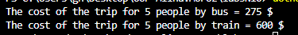

# Лабораторна робота №3
## Тема: Наслідування: основи
##  Опис реалізації
У програмі реалізована проста система для обчислення вартості поїздки на транспорті для групи з 5 осіб.

### 1. Базовий клас `Ticket`
- Містить віртуальний метод `GetPrice()`, який виводить загальний текст: **"The cost of the trip for 5 people "**.
- Цей метод є спільним для всіх типів квитків.

### 2. Клас `BusTicket`
- Наслідує клас `Ticket`.
- Має поле `price_b = 55` (вартість одного квитка на автобус).
- Метод `PriceOfTravel()` рахує загальну ціну для 5 осіб.
- Перевизначає метод `GetPrice()`, де спочатку викликає базовий метод, а потім додає інформацію про автобус.

### 3. Клас `TrainTicket`
- Наслідує клас `Ticket`.
- Має поле `price_t = 120` (вартість одного квитка на потяг).
- Метод `PriceOfTravel()` повертає вартість для 5 осіб.
- Перевизначає метод `GetPrice()`, щоб вивести ціну для поїздки потягом.

### 4. Клас `Program`
- Створює об’єкти типу `Ticket`, але з конкретними реалізаціями:
```csharp
Ticket bus = new BusTicket();
Ticket train = new TrainTicket();
```
- Виводить результат користувачу.<br><br>
