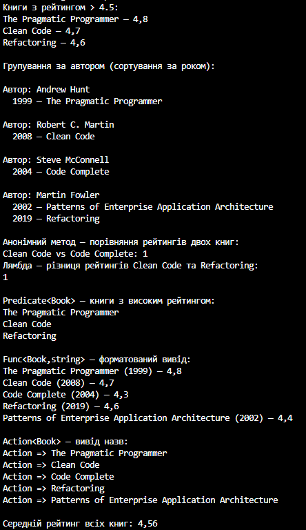

# Лабораторна робота №6
## Тема: Лямбда-вирази, анонімні функції та делегати у C#
## Мета: Закріпити знання про делегати та події. Навчитись використовувати анонімні методи, лямбда-вирази і вбудовані делегати (Func<>, Action<>, Predicate<>). Отримати практичний досвід застосування лямбда-виразів у колекціях і LINQ-операціях.
## Опис реалізації
У ході виконання лабораторної роботи було розроблено консольний застосунок мовою C#, який демонструє принципи об’єктно-орієнтованого програмування, використання делегатів, лямбда-виразів та LINQ для обробки колекцій об’єктів.

Першим етапом було створення класу Book, що містить основні характеристики книги: назву, автора, рік видання та рейтинг. На основі цього класу було сформовано колекцію List<Book>, яка слугує джерелом даних для подальшої обробки.

Для аналізу колекції застосовано запити LINQ. Зокрема, було виконано:

1. Вибір книг з рейтингом понад 4.5 за допомогою методу Where.

2. Групування книг за авторами з використанням GroupBy.

3. Сортування книг у кожній групі за роком видання через OrderBy.

4. Формування нових структур даних методом Select.

5. Обчислення середнього рейтингу всіх книг за допомогою Aggregate.

У межах роботи було продемонстровано використання різних типів делегатів. Створено власний делегат MyMathDelegate, який застосовано для виконання операцій над рейтингами книг. Наведено два практичні приклади:

- Анонімний метод, який порівнює рейтинги двох книг та повертає результат порівняння.

- Лямбда-вираз, який обчислює різницю між рейтингами.

Також реалізовано застосування вбудованих делегатів:

- Predicate<Book> — для фільтрації книг з високим рейтингом.

- Func<Book, string> — для форматування інформації про книгу.

- Action<Book> — для виконання дії над кожним елементом колекції (вивід назв книг).

Кінцевий результат виконання програми було виведено в консоль: знайдені книги з високим рейтингом, згруповані та відсортовані дані, порівняння рейтингів, результати роботи делегатів та обчислення середнього рейтингу.

Таким чином, у роботі успішно продемонстровано використання об’єктно-орієнтованих підходів, LINQ-обробки, різних видів делегатів, а також анонімних методів і лямбда-виразів відповідно до поставлених вимог лабораторної роботи.
## Вивід програми
