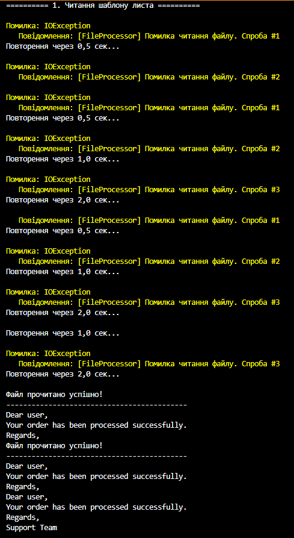
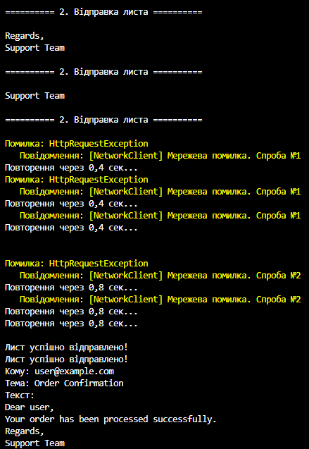

# Лабораторна робота №7  
## Тема: Обробка IO/мережевих помилок та патерн Retry.
## Мета: Навчитися обробляти типові помилки вводу/виводу та мережеві помилки за допомогою блоків try-catch-finally, а також реалізувати патерн Retry для підвищення відмовостійкості застосунків.

## Завдання
Реалізувати сценарій відправки електронного листа з використанням класів:

### ✉ FileProcessor
- Метод `string GetEmailTemplate(string path)`
- Імітує читання шаблону листа з файлу.
- Має викидати `IOException` **перші 3 рази**, після чого повертати успішний результат.

### NetworkClient
- Метод `void SendEmail(string recipient, string subject, string body)`
- Імітує мережеву операцію.
- Має викидати `HttpRequestException` **перші 2 рази**, після чого успішно виконувати відправку.

### Контрольні запитання
**1.** Які типи винятків найчастіше виникають при роботі з файлами та мережею?

При роботі з файлами (IO):
- IOException — загальна помилка вводу/виводу (наприклад, файл зайнятий, недоступний диск).
- FileNotFoundException — файл не знайдено.
- DirectoryNotFoundException — каталог не знайдено.
- UnauthorizedAccessException — немає прав на доступ до файлу.

При роботі з мережею:
- HttpRequestException — проблеми з HTTP-запитом (сервер недоступний, тайм-аут).
- SocketException — помилки на рівні мережевих сокетів.
- TimeoutException — перевищено час очікування відповіді.

**2.** Поясніть принцип роботи патерну Retry. Коли його доцільно використовувати?

Принцип роботи. Спершу виконується операція (наприклад, читання файлу або відправка запиту). Якщо операція успішна - результат повертається. Якщо виникла помилка - перевіряється, чи слід повторювати (через shouldRetry). Виконується пауза, після чого операція повторюється. Повторюватися можна до заданої максимальної кількості спроб (retryCount). Доцільно використовувати при тимчасових помилках: нестабільна мережа, заблокований файл, тайм-аут сервера. Також, для підвищення відмовостійкості додатків без потреби ручного повторення дій користувачем.

**3.** Як реалізувати експоненційну затримку між повторними спробами?
```csharp
var delay = TimeSpan.FromMilliseconds(initialDelay.TotalMilliseconds * Math.Pow(2, attempt - 1));
Thread.Sleep(delay);
```
**4.** Для чого потрібен делегат shouldRetry у допоміжному класі RetryHelper?

Делегат визначає, чи слід повторювати операцію для конкретного винятку. Дозволяє фільтрувати помилки, щоб Retry застосовувався тільки для тимчасових або допустимих винятків. Якщо shouldRetry повертає false → повторення не відбувається, виняток передається далі.

### Вивід програми

